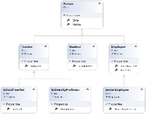
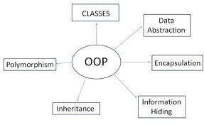
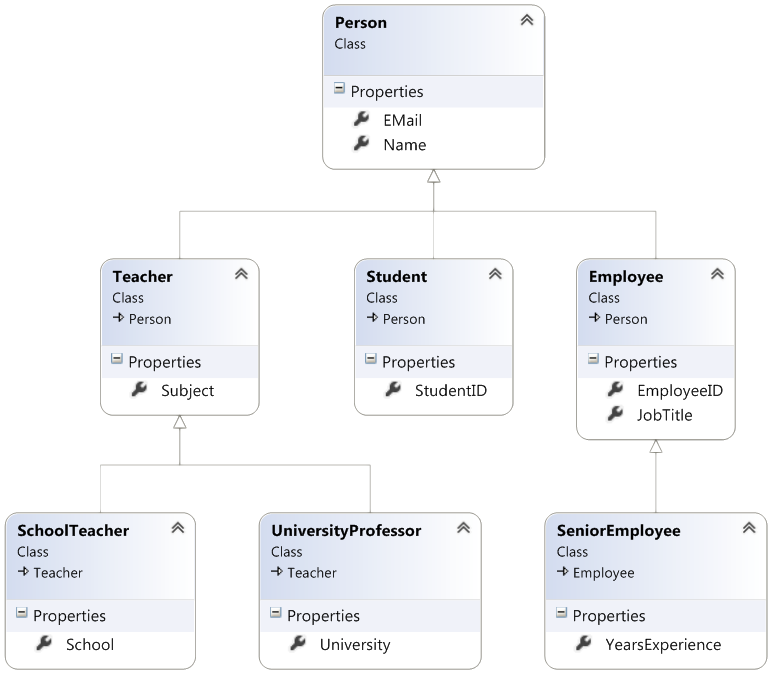
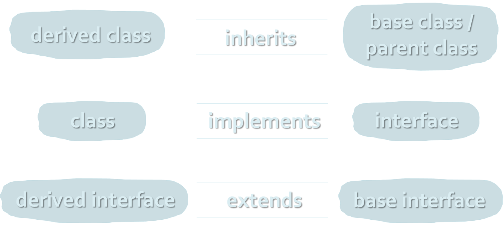
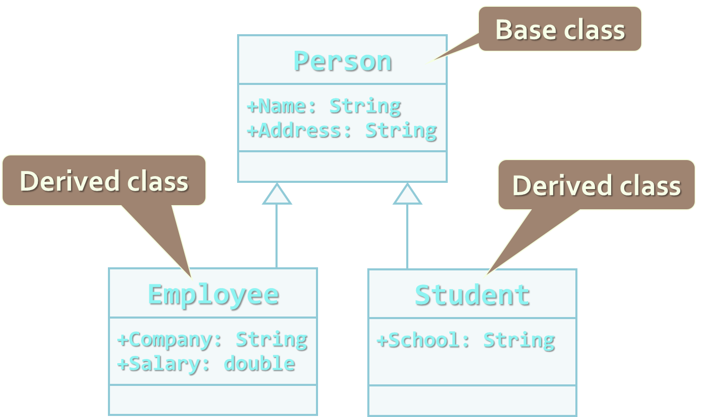
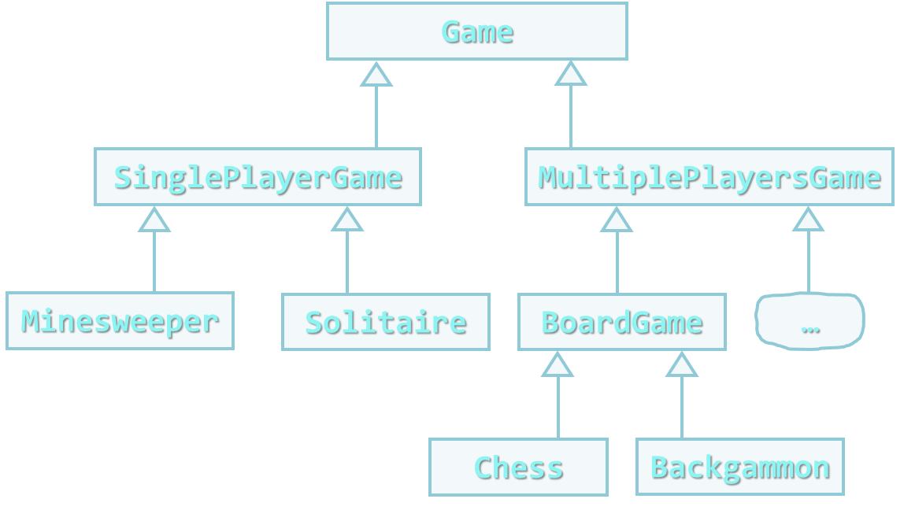
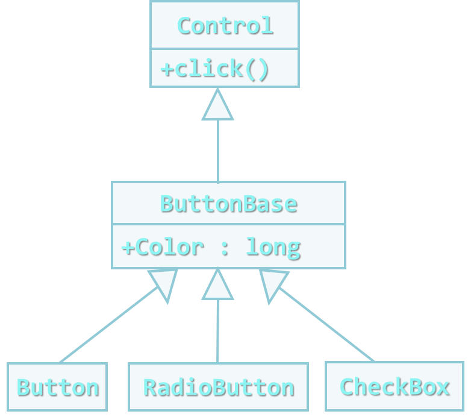
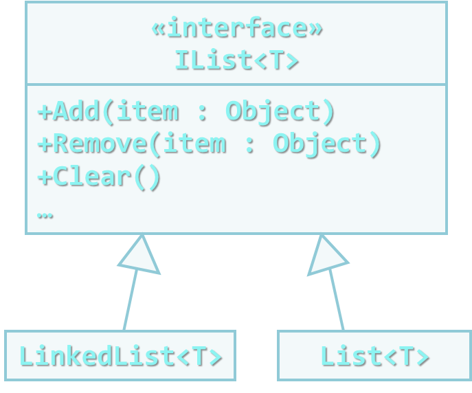
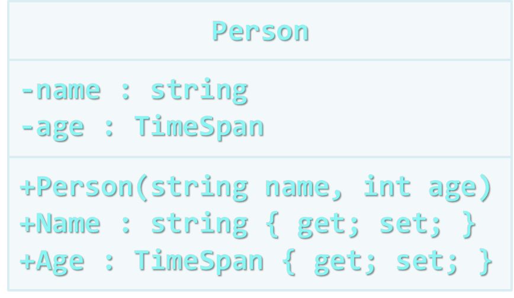
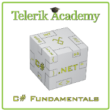

 <!-- section start -->
<!-- attr: { class:'slide-title', showInPresentation:true, hasScriptWrapper:true } -->
# Inheritance in TypeScript
## Inheritance, Abstraction, Encapsulation

<!--  -->
<!--  -->
<!--  -->
<!--  -->
<div class="signature">
	<p class="signature-course">TypeScript OOP</p>
	<p class="signature-initiative">Telerik School Academy</p>
	<a href = "https://telerikacademy.com" class="signature-link">https://telerikacademy.com</a>
</div>


<!-- section start -->
<!-- attr: { showInPresentation:true, hasScriptWrapper:true } -->
# Table of Contents
- [Fundamental Principles of OOP](#oop)
- [Inheritance](#inheritanceId)
  - [Class Hierarchies](#classHierarchies)
  - [Inheritance and Access Levels](#accessLevels)
- [Abstraction](#abstractionId)
  - [Abstract Classes](#abstractClassesId)
- [Encapsulation](#encapsulationId)

<!--  -->
<!--  -->


<!-- section start -->
<!-- attr: { class:'slide-section', showInPresentation:true, hasScriptWrapper:true } -->
<!-- # Fundamental principles of OOP -->

<!--  -->


<!-- attr: { id:'oop', showInPresentation:true, hasScriptWrapper:true } -->
# <a id="oop"></a>Fundamental Principles
- **Inheritance**
  - Inherit members from parent class
- **Abstraction**
  - Define and execute abstract actions
- **Encapsulation**
  - Hide the internals of a class
- **Polymorphism**
    - Access a class through its parent interface

<!-- attr: { showInPresentation:true, hasScriptWrapper:true } -->
<!-- # Inheritance -->

<!--  -->


<!-- attr: { showInPresentation:true, hasScriptWrapper:true } -->
# Classes and Interfaces
- **Classes** define attributes and behavior
  - Fields, properties, methods, etc.
  - Methods contain code for execution

```typescript
class Labyrinth { public cellsCount: number }
```

- **Interfaces** define a set of operations
  - Empty methods and properties, left to be implemented later


```typescript
interface IFigure { draw(): void }
```

<!-- attr: { id:'inheritanceId', showInPresentation:true, hasScriptWrapper:true } -->
# <a id="inheritanceId"></a>Inheritance
- **Inheritance allows child** classes to **inherit** the characteristitypescript of an existing **parent** (**base**) class
  - Attributes(fields and properties)
  - Operations(methods)
- Child class can extend the parent class
  - Add new fields and methods
  - Redefine methods(modify existing behavior)
- A class can **implement** an interface by providing implementation for all  of its methods


<!-- attr: { showInPresentation:true, hasScriptWrapper:true } -->
# Types of Inheritance
- Inheritance terminology


<!--  -->


<!-- attr: { showInPresentation:true, hasScriptWrapper:true } -->
# Inheritance – Benefits
- Inheritance has a lot of benefits
  - Extensibility
  - Reusability (**code reuse**)
  - Provides abstraction
  - Eliminates redundant code
- Use inheritance for buidling **is-a** relationships
  - E.g.dog **is-a** animal(dogs are kind of animals)
- Don't use it to build **has-a** relationship
  - E.g.dog **has-a** name(dog is not kind of name)

<!--  -->


<!-- attr: { showInPresentation:true, hasScriptWrapper:true } -->
# Inheritance
- **Inheritance** implicitly gains **all members** from another class
  - All fields, methods, properties …
  - Some members could be inaccessible (hidden)
- The class whose methods are inherited is called **base** (parent) class
- The class that gains new functionality is called **derived** (child) class


<!-- attr: { showInPresentation:true, hasScriptWrapper:true } -->
<!-- # Inheritance – _Example_ -->


<!--  -->


<!-- attr: { id:'classHierarchies', showInPresentation:true, hasScriptWrapper:true } -->
# <a id="classHierarchies"></a>Class Hierarchies
- **Inheritance** leads to a **hierarchies of classes** <br /> and / or interfaces in an application:


<!--  -->


<!-- attr: { showInPresentation:true, hasScriptWrapper:true } -->
# Inheritance in TypeScript
- A class can inherit only one base class
  - E.g. <code>IOException</code> derives from <code>SystemException</code> and it derives from <code>Exception</code>
- A class can implement several interfaces
  - E.g. <code>List&lt;T&gt;</code> implements <code> IList&lt;T&gt;</code>, <code>ICollection&lt;T&gt;</code>, <code>IEnumerable&lt;T&gt;</code>
- An interface can implement several interfaces
  - E.g. <code>IList&lt;T&gt;</code> implements <code>ICollection&lt;T&gt;</code> and <code>IEnumerable&lt;T&gt;</code>


<!-- attr: { showInPresentation:true, hasScriptWrapper:true } -->
# How to Define Inheritance?
- Specify the name of the base class after the name of the derived(using `extends`)

```typescript
class Shape
{ … }
class Circle extends Shape
{ … }
```

- Use the keyword `super` to invoke the parent constructor


```typescript
constructor(x: number, y: number) {
			super(x);
	}
```


<!--  -->
<!--  -->


<!-- attr: { showInPresentation:true, hasScriptWrapper:true } -->
# Simple Inheritance _Example_

```typescript
class Mammal
{
    constructor(public age:number) {
        this.age = age;
    }

    sleep(): void {
        console.log("Shhh! I'm sleeping!");
    }
}
```


<!--  -->


<!-- attr: { showInPresentation:true, hasScriptWrapper:true } -->
<!-- # Simple Inheritance _Example_ -->

```typescript
class Dog extends Mammal {
    constructor(public breed: number, age: number) {
        super(age);
        this.breed = breed;
    }

    wigTail(): void {
        console.log("Tail wagging...");
    }
}
```


<!--  -->


<!-- attr: { class:'slide-section demo', showInPresentation:true, hasScriptWrapper:true } -->
<!-- # Simple Inheritance
## [Demo]() -->

<!--  -->
<!--  -->


<!-- attr: { id:'accessLevels', showInPresentation:true, hasScriptWrapper:true } -->
# <a id="accessLevels"></a>Access Levels
- Access modifiers in TypeScript
  - <code>public</code> – access is not restricted
  - <code>private</code> – access is restricted to the containing type
  - <code>protected</code> – access is limited to the containing type and types derived from it


<!-- attr: { showInPresentation:true, hasScriptWrapper:true, style: 'font-size: 0.8em' } -->
# Inheritance and Accessibility

```typescript
class Creature {
    protected _name: string;
    public get name(): string {
        return this.name;
    }

    protected walk(): void {
        console.log("Walking ...");
    }

    private talk(): void {
        console.log("I am creature ...");
    }

}

class Mammal extends Creature {
    // super.walk() can be invoked here
    // super.talk() cannot be invoked here
    // this.name can be read but cannot be modified here
}
```


<!-- attr: { showInPresentation:true, hasScriptWrapper:true, style: 'font-size: 0.8em' } -->
<!-- # Inheritance and Accessibility -->

```typescript
class Dog extends Mammal {
    private _breed: string;

    public get breed(): string {
        return this._breed;
    }

    // super.talk() cannot be invoked here (it is private)
}

let joe: Dog = new Dog(6, "Labrador");
console.log(joe.breed);
// joe.walk() is protected and can not be invoked
// joe.talk() is private and can not be invoked
// joe.name = "Rex"; // Name cannot be accessed here
// joe.breed = "Shih Tzu"; // Can't modify Breed
```


<!-- attr: { class:'slide-section demo', showInPresentation:true, hasScriptWrapper:true } -->
<!-- # Inheritance and Accessibility
## [Demo]() -->

<!--  -->


<!-- attr: { showInPresentation:true, hasScriptWrapper:true, style: 'font-size: 0.8em' } -->
# Inheritance: Important Aspects
- In TypeScript there is no **multiple** inheritance
  - Only multiple interfaces can be implemented
- Static members are also inherited
- Constructors are not inherited
- Inheritance is a **transitive** relation
  - If C is derived from B, and B is derived from A, then C inherits A as well


	<!-- attr: { showInPresentation:true, hasScriptWrapper:true, style: 'font-size: 0.8em' } -->
# Inheritance: Important Features
- When a derived class extends its base class
  - It can freely add new members
  - Cannot remove derived ones
- Declaring new members with the same name or signature results in an error
- A class can declare `abstract` methods and properties
  - Derived classes can `override` the implementation of these members


<!-- section start -->
<!-- attr: { class:'slide-section', showInPresentation:true, hasScriptWrapper:true } -->
<!-- # Abstraction -->

<!--  -->
<!--  -->
<!--  -->


<!-- attr: { id:'abstractionId', showInPresentation:true, hasScriptWrapper:true } -->
# <a id="abstractionId"></a>Abstraction
- **Abstraction** means ignoring irrelevant features, properties, or functions and emphasizing the relevant ones...
- ... relevant to the given project
  - With an eye to future reuse in similar projects
- Abstraction helps **managing complexity**


<!-- attr: { showInPresentation:true, hasScriptWrapper:true } -->
<!-- # Abstraction (2) -->
- Abstraction is something we do every day
  - Looking at an object, we see those things about it that have meaning to us
  - We abstract the properties of the object, and keep only what we need
  - E.g.students get "name" but not "color of eyes"
- Allows us to represent a complex reality in terms of a simplified model
- Abstraction highlights the properties of an entity that we need and hides the others


<!-- attr: { showInPresentation: true, hasScriptWrapper: true } -->
# Abstraction in TypeScript
- In TypeScript, abstraction is achieved in several ways:
  - Abstract classes
  - Interfaces
  - Inheritance

<!--  -->
<!--  -->


<!-- attr: { id:'abstractClassesId', showInPresentation:true, hasScriptWrapper:true } -->
# <a id="abstractClassesId"></a>Abstract Classes
- **Abstract classes** are special classes defined with the keyword <code>abstract</code>
  - Mix between class and interface
  - Partially implemented or fully unimplemented
  - Not implemented methods are declared <code>abstract</code> and are left empty
  - Cannot be instantiated directly
- Child classes should implement all abstract methods or be declared as <code>abstract</code> too


<!-- attr: { showInPresentation: true, hasScriptWrapper: false } -->
<!-- # Abstract Classes -->
- **Abstract methods** are empty methods without implementation
  - The implementation is **intentionally left** for the descendent classes
- When a class contains **at least one abstract method**, it is called **abstract class**
- Abstract classes model abstract concepts
  - E.g. person, object, item, movable object


<!-- attr: { showInPresentation:true, hasScriptWrapper:true } -->
# Abstract Class – _Example_

```typescript
abstract class MovableShape implements IShape, IMovable {
    private x: number; private y: number;

    move(deltaX: number, deltaY: number): void {
        this.x += deltaX;
        this.y += deltaY;
    }

    setPosition(x: number, y: number): void {
        this.x = x;
        this.y = y;
    }

    abstract calculateSurface(): number;
}
```


<!-- attr: { showInPresentation:true, hasScriptWrapper:true, style: 'font-size: 0.9em' } -->
# Interfaces vs. Abstract Classes
- TypeScript **interfaces** are like **abstract classes**, but in contrast interfaces:
  - Can not contain methods with implementation
    - All interface methods are abstract
  - Members do not have scope modifiers
    - Their scope is assumed public
    - But this is not specified explicitly
  - Can not define fields, constants, inner types and constructors


<!-- attr: { showInPresentation:true, hasScriptWrapper:true } -->
# Abstract Classes – _Example_

```typescript
abstract class Animal implements IComparable<Animal> {
    private _speed: number;

    public abstract getName(): string;
    public abstract get speed(): number;

    compareTo(other: Animal): number {
        if (this.speed > other.speed) {
            return 1;
        } else if (this.speed < other.speed) {
            return -1;
        }
        return 0;
    }
}
```


<!-- attr: { showInPresentation:true, hasScriptWrapper:true } -->
<!-- # Abstract Classes – _Example_ -->

```typescript
class Turtle extends Animal {
    public get speed(): number { return 10; }

    public getName(): string { return "Turtle"; }
}

class Cheetah extends Animal {
    public get speed(): number { return 300; }

    public getName(): string { return "Cheetah"; }
}
```


<!-- attr: { class:'slide-section demo', showInPresentation:true, hasScriptWrapper:true } -->
<!-- # Abstract Classes
## [Demo]() -->


<!-- attr: { showInPresentation:true, hasScriptWrapper:true } -->
# Abstract Data Types
- Abstract Data Types(ADT) are data types defined by a set of operations (interface)
- _Example_: <code>IList&lt;T&gt;</code> in .NET Framework

 <!--  -->
<!--  -->


<!-- attr: { showInPresentation:true, hasScriptWrapper:true } -->
# Inheritance Hierarchies
- Using inheritance we can create inheritance hierarchies
  - Easily represented by UML class diagrams
- UML class diagrams
  - Classes are represented by rectangles containing their methods and data
  - Relations between classes are shown as arrows
    - Closed triangle arrow means inheritance
    - Other arrows mean some kind of associations


<!-- section start -->
<!-- attr: { class:'slide-section', showInPresentation:true, hasScriptWrapper:true } -->
<!-- # Encapsulation -->

<!--  -->


<!-- attr: { id:'encapsulationId', showInPresentation:true, hasScriptWrapper:true } -->
# <a id="encapsulationId"></a>Encapsulation
- Encapsulation hides the implementation details
- Class announces some operations (methods) available for its clients – its **public interface**
- All data members (fields) of a class should be hidden
  - Accessed via properties (read-only and read-write)
- No interface members should be hidden


<!-- attr: { showInPresentation:true, hasScriptWrapper:true } -->
# Encapsulation – _Example_
- Data fields are private
- Constructors and accessors are defined (getters and setters)

<!--  -->


<!-- attr: { showInPresentation:true, hasScriptWrapper:true } -->
# Encapsulation in TypeScript
- Fields are mostly declared as <code>private</code>
  - Accessed through **properties** in read-only or read-write mode
- Interface methods are always <code>public</code>
  - Not explicitly declared with <code>public</code>
- Non-interface methods are declared <br /> <code>private</code> / <code>protected</code>


<!-- attr: { showInPresentation:true, hasScriptWrapper:true } -->
# Encapsulation – Benefits
- Ensures that structural changes remain local:
  - Changing the class internals does not affect any code outside of the class
  - Changing methods' implementation does not reflect the clients using them
- Encapsulation allows adding some logic when accessing client's data
  - E.g. **validation** on modifying a property value
- Hiding implementation details reduces complexity &rarr; easier maintenance


<!-- attr: { class:'slide-section demo', showInPresentation:true, hasScriptWrapper:true } -->
<!-- # Encapsulation
## [Demo]() -->


<!-- attr: { class:'slide-section demo', showInPresentation:true, hasScriptWrapper:true } -->
<!-- # Questions? -->


<!-- attr: { showInPresentation:true, hasScriptWrapper:true } -->
# Free Trainings @ Telerik Academy
- TypeScript Programming @ Telerik Academy
    - [TypeScript OOP Course](http://telerikacademy.com/Courses/Courses/Details/393)
  - Telerik School Academy
    - [academy.telerik.com](typescriptharpfundamentals.telerik.com)
  - Telerik Academy @ Facebook
    - [facebook.com/TelerikAcademy](facebook.com/TelerikAcademy)
  - Telerik Software Academy Forums
    - [forums.academy.telerik.com](forums.academy.telerik.com)

<!--  -->
<!--  -->
<!--  -->
<!--  -->
