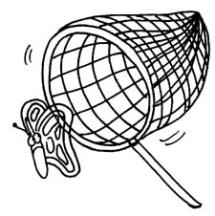
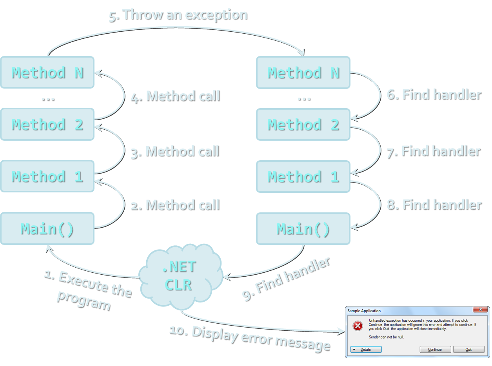

<!-- section start -->
<!-- attr: {  class:'slide-title', showInPresentation:true, hasScriptWrapper:true } -->
# Exception Handling
## Handling Errors during the Program Execution
<!--  -->
<!--  -->

<div class="signature">
	<p class="signature-course">TypeScript OOP</p>
	<p class="signature-initiative">Telerik School Academy</p>
	<a href="https://telerikacademy.com" class="signature-link">https://telerikacademy.com</a>
</div>


<!-- section start -->

<!-- attr: { showInPresentation:true, hasScriptWrapper:true } -->
# Table of Contents
- [What are Exceptions?](#what-are-exceptions)
- [Handling Exceptions](#handling-exceptions)
- [The System.Exception Class](#system-exception-class)
- [Exception types and hierarchy](#exception-types)
- [Raising (Throwing) Exceptions](#throwing-exceptions)
- [Best Practices](#best-practices)

<!--  -->


<!-- section start -->
<!-- attr: { id:'what-are-exceptions', class:'slide-section', showInPresentation:true, hasScriptWrapper:true } -->
<!-- # <a id="what-are-exceptions"></a> What are Exceptions? -->
<!-- ## The Paradigm of Exceptions in OOP -->


<!-- attr: { showInPresentation:true, hasScriptWrapper:true, style:'font-size: 0.9em' } -->
# What are Exceptions?
- The `exceptions` in TypeScript are classic implementation of the OOP exception model
- Deliver **powerful mechanism for centralized handling of errors** and unusual events
- Substitute procedure-oriented approach, in which each function returns error code
- **Simplify code construction and maintenance**
- **Allow the problematic situations to be processed at multiple levels**
- [Read more](https://en.wikipedia.org/wiki/Exception_handling) about exception handling in general on wikipedia

<!-- section start -->

<!-- attr: { id:'handling-exceptions', class:'slide-section', showInPresentation:true, hasScriptWrapper:true } -->
<!-- # <a id=""></a> Handling Exceptions -->

<!--  -->


<!-- attr: { showInPresentation:true, hasScriptWrapper:true } -->
# Handling Exceptions
- In TypeScript the exceptions can be handled by the `try-catch-finally` construction

```js
try {
    // Do some work that can raise an exception
} catch (error) {
    // Handle the caught exception
}
```

- `catch` blocks can be used multiple times to process different exception types

<!--  -->


<!-- attr: { showInPresentation:true, hasScriptWrapper:true } -->
# Handling Exceptions – _Example_

```js
function parseToNumber(str: string): number{
  let n = parseInt(string, 10);
  if(isNaN(n)){
    throw new Error("This is not a number");
  }

  return n;
}
```

<!--  -->


<!-- attr: {  class:'slide-section demo', showInPresentation:true, hasScriptWrapper:true } -->
<!-- # Handling Exceptions -->

<!--  -->


<!-- attr: { id:'system-exception-class',  showInPresentation:true, hasScriptWrapper:true, style:'font-size: 0.9em' } -->
# <a id="system-exception-class"></a> The System.Exception Class
- **Exceptions in TypeScript are objects**
  - Actually any object can be used as an exception
  - Using the built-in exceptions is better
    - they contain information about the error

```js
try {
  // Do some works that can cause an exception
} catch (error) {
    // Handle the caught arithmetic exception
}
```

- Handles any type of exception thrown

<!--  -->

<!-- attr: { showInPresentation:true, hasScriptWrapper:true } -->
# Throwing Exceptions
- Exceptions are thrown (raised) by `throw` keyword in C#
  - Used to notify the calling code in case of error or unusual situation
- When an exception is thrown:
  - The program execution stops
  - The exception travels over the stack until a suitable `catch` block is reached to handle it
- Unhandled exceptions display error message


<!-- attr: { showInPresentation:true, hasScriptWrapper:true } -->
<!-- # How Exceptions Work? -->

<!--  -->


<!-- attr: { showInPresentation:true, hasScriptWrapper:true, style:'font-size: 0.9em' } -->
# Using throw Keyword
- Throwing an exception with an error message:

```js
throw new Error("Invalid amount!");
```

- Exceptions can accept message and cause:
- _Note_: if the original exception is not passed the initial cause of the exception is lost

<!-- section start -->
<!-- attr: { class:'slide-section', showInPresentation:true, hasScriptWrapper:true } -->
<!-- # Using Try-Finally Blocks -->
<!--  -->


<!-- attr: { showInPresentation:true, hasScriptWrapper:true, style:'font-size: 0.95em' } -->
# The try-finally Statement
- The statement:

```js
try {
    // Do some work that can cause an exception
} finally {
    // This block will always execute
}
```

- Ensures execution of given block in all cases
  - When exception is raised or not in the `try` block
- Used for execution of cleaning-up code, e.g. releasing resources

<!-- section start -->
<!-- attr: { class:'slide-section', showInPresentation:true, hasScriptWrapper:true } -->
<!-- # Exception Handling
## Questions? -->


<!-- attr: { showInPresentation:true, hasScriptWrapper:true } -->
# Free Trainings @ Telerik Academy
- C# Programming @ Telerik Academy
  - [CSharp Advanced course](http://academy.telerik.com/student-courses/programming/csharp-programming-part-2/about)
- Telerik Software Academy
  - [academy.telerik.com](http://academy.telerik.com)
- Telerik Academy @ Facebook
  - [facebook.com/TelerikAcademy](https://facebook.com/TelerikAcademy)
- Telerik Software Academy Forums
  - [forums.academy.telerik.com](https://telerikacademy.com/Forum/Home)
